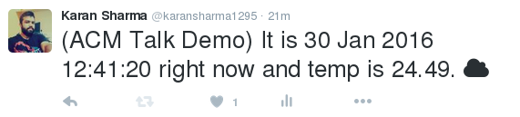

# api-bot-python
Using twitter api and forecast.io created a bot which tweets weather status

Windows command to activate venv : venv\Scripts\activate.bat

Slides :  
http://slides.com/karansharma-2/deck/fullscreen
iPythonNotebook : 
[link to notebook](tweepydemo.ipynb)

